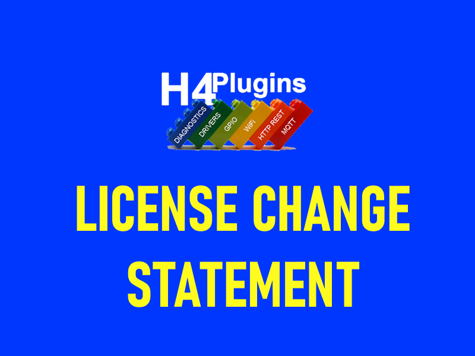

# LICENSE CHANGE STATEMENT [Jan 2026]

We are a group of people who were very close to Phil Bowles and where some of us were helping and assisting him in the project.

After the passage of Phil in June 2022, We've taken advantage of the whole stack, upgraded it deeply, made it workable, with major features added, and it becomes bug-free as far as we know.

Phil had imposed a commercial license during the last year of his life, to gain some profit and to prevent rude people from benefitting it "You want support? pay for it".

Therefore, we've reached the conclusion of the inevitability of changing the license to a more permissible one, that would open H4 up to the world and public. The following points are noted:
We've tried contacting Phil's family (his sister, and ex-wife) with no success, both of whom appear to be unaware of the H4 project and not online available, where by the fact that a restrictive commercial license had been imposed: That even if someone wants to pay for H4, they can't, as there is now no longer a contact to agree with or even to receive such payment.
Our contributions to the H4 project had revived it after it was practically dead, starting from the TCP library to MQTT, HTTP Webserver, HTTP Client, H4Plugins, and even the base H4 scheduler library. Many with major code upgrades and major features and functionalities added, and porting to some additional platforms.
It's confirmed that we're not doing such an action for our interest, as we've had already a direct approval from Phil personally to use the project commercially -as his friends and assistants with bugs finding and testing-, knowing that his change of the license to a restricting one was to prevent rude people from benefitting his efforts while he was in need to gain some income.
The opening of the license for more commercial uses enables the project to evolve, gain a wider audience and better peer review.
It's our belief that opening the project licensing to the public for public gain would be the best thing we can provide to Phil.

**H4Group:**
- Adam Sharp
- Hamzah Hajeir
- Peter Kling
- Nibir Chakraborty
- Stephen Binks
- Derryck Croker
- Peter Peters
- Colin A Kerr
